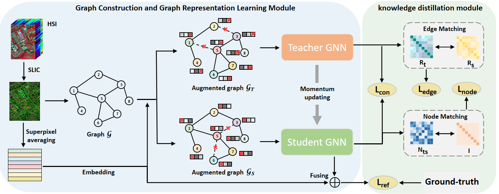

# Graph Knowledge Distillation Guided Few-shot Learning for Hyperspectral Image Classification 


[Xiaolong Li](), [Huifang Ma](https://scholar.google.com/citations?user=r4iH7uIAAAAJ&hl=zh-CN&oi=sra), [Shuheng Guo](), [Di Zhang](), [Zhixin Li](https://scholar.google.com/citations?user=YSxg4CMAAAAJ&hl=zh-CN)


<!-- #### News
- **2022.04.17 :** Our paper has been accepted by CVPRW 2022, code and models have been released. :rocket: 
- **2022.04.02 :** We win the **First** place of NTIRE 2022 Challenge on Spectral Reconstruction from RGB. :trophy: 

|             480 nm              |              520 nm              |              580 nm              |              660 nm              |
| :-----------------------------: | :------------------------------: | :------------------------------: | :------------------------------: |
|  |  |  |   | -->


<hr />

> **Abstract:** Hyperspectral image classification aims to accurately classify each pixel in hyperspectral image with partially labeled information, which is crucial for the precise identification and differentiation of various land cover types. In recent years, Graph Neural Networks (GNNs)-based hyperspectral image classification have exhibited exceptional performance when a substantial number of labeled samples are available. However, the acquisition of annotation data is often a labor-intensive and time-consuming process in practical scenarios. When the number of available labeled samples is limited, the model’s performance can easily degrade. To tackle the above issue, a Graph Knowledge Distillation-guided Few-Shot Learning method (GKDFSL) is proposed for hyperspectral image classification. Specifically, for a comprehensive modeling of hyperspectral image features, a graph structure is first constructed from segmented superpixels. Subsequently, graph augmentation is performed to generate two separate graph perspectives. Teacher and student GNNs are then applied to each perspective to extract superpixel features. Knowledge distillation techniques are then utilized to transmit diverse knowledge learned by the teacher GNNs to the student GNNs, thereby enabling the student model to effectively capture the latent associations between unlabeled superpixels. To further enhance the model’s understanding and learning capabilities, GNNs are integrated with the Mean teacher framework to improve generalization. Moreover, ensemble learning is introduced to bolster the robustness of the method. Extensive experiments conducted on four benchmark datasets have shown that the proposed method outperforms other competitive methods in terms of classification accuracy and generalization performance. The code for this study is available at https://github.com/TX-loong/GKDFSL.git. 
<hr />


## Network Architecture
<!--  -->
<div aligh=center witdh="200"></div>


## 1. Create Envirement:

- Python 3 (Recommend to use [Anaconda](https://www.anaconda.com/download/#linux))

- NVIDIA GPU + [CUDA](https://developer.nvidia.com/cuda-downloads)


## 2. Data Preparation:
- Download the data including raw `.mat` files and corresponding `.jpg` files used in superpixel segmentation from <a href="https://pan.baidu.com/s/1LwH5CACkvyIJ7rzwrynU3g">here</a> (code: TXtx) for a quick start and place them in `GKDFSL-master/`.

- Before trainig, every data set is split by runing `trainTestSplit.py`, shown as follow:

  ```shell
  python trainTestSplit.py --name PaviaU (data set name)
  ```

## 3. Training

To train a model, run

```shell
# Training on PaviaU data set
python train.py --name PaviaU --block 100 --gpu 0 
```
Here, `--block` denots the number of superpixel, which lies in `[50, 100, 150, 200]` in our ensemble setup.

The model with best accuracy will be saved.


## 4. Prediction:

To test a trained model, run 

```shell
# Testing on PaviaU data set
python predict.py --name PaviaU --block 100 --gpu 0
```

## 5. Multi-scale ensemble learning:

After training and prediction at four scales, ensemble learning is performed.

```shell
python Ten_Maxvoting.py
python Four_Maxvoting.py
```


